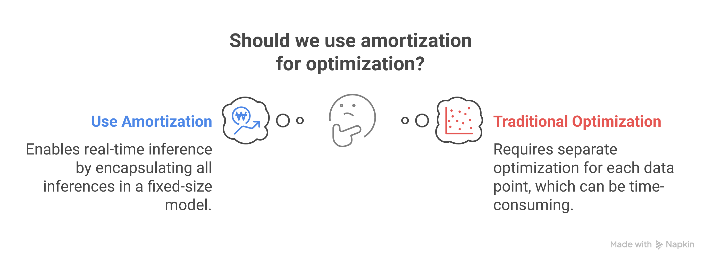

## Amortized Variational Inference

---

## Motivation for Amortization

- For each observation $x_i \in \mathcal{X}$, we want to infer information about the latent variable $z$.  
    - Traditionally, we would approximate $p(z|x_i)$ with a separate variational distribution $q_i(z)$ for each data point.
    - Unfortunately, the number of parameters grows with the dataset size, since each $q_i(z)$ is unique to $x_i$.
- **Solution: Amortized Inference**  
    Introduce a neural network (recognition model) with shared parameters $\phi$ to approximate all $q_i(z)$:
    $$
    q_\phi(z|x) \approx q_i(z) \quad \forall x_i \in \mathcal{X}
    $$
    - The network $q_\phi(z|x)$ maps any observation $x$ to a distribution over $z$.
    - The number of parameters is fixed (does not scale with dataset size).
    - Inference becomes efficient and scalable.

---

## Amortization

- Replace many per-data-point distributions $q_i(z)$ with a single, parameterized network $q_\phi(z|x)$ that generalizes across all observations.
- Refers to transforming what would traditionally be a separate optimization for each data point (or each time step) into a shared optimization across all data points (or time steps).  
- Instead of optimizing variational parameters from scratch at every inference, one learns a recognition model -- a neural network -- whose weights (amortization parameters) $\phi$ produce approximate posterior distributions in a single forward pass.  
- Recognition model $q_\phi(z|x)$ acts as a proxy for the expensive per-instance optimization with $\phi$ representing weights of that proxy model.
- Amortized parameters $\phi$ encapsulate all inferences in a fixed-size model, enabling real-time inference.

<!-- ---

## Amortization in Active Inference

-  -->