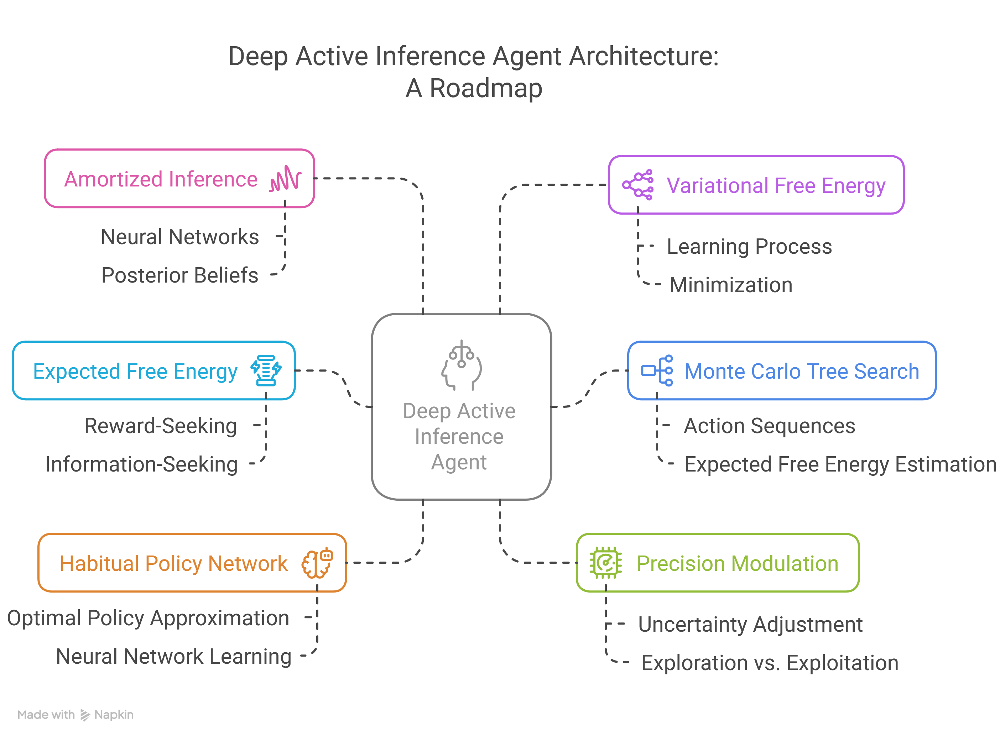

# Deep Active Inference with Monte Carlo Tree Search

## Overview

{height=82%}

<!-- 
In this section, we introduce a Deep Active Inference agent that leverages *Monte Carlo Tree Search* (MCTS) for planning and decision-making.

#### Roadmap
1. **Amortized Inference:** Utilizes neural networks to quickly approximate posterior beliefs about states and actions.
2. **Variational Free Energy:** The agent learns by minimizing variational free energy.
3. **Expected Free Energy (EFE):** Guides action selection by considering both reward-seeking and information-seeking behaviors.
4. **Monte Carlo Tree Search:** Uses MCTS to efficiently explore possible future action sequences and estimate their expected free energy.
5. **Habitual Policy Network:** A neural network learns to approximate the optimal policy, enabling fast habitual action selection.
6. **Precision Modulation:**  Adjusts dynamically the agent's uncertainty about states and actions to balance exploration and exploitation. -->
