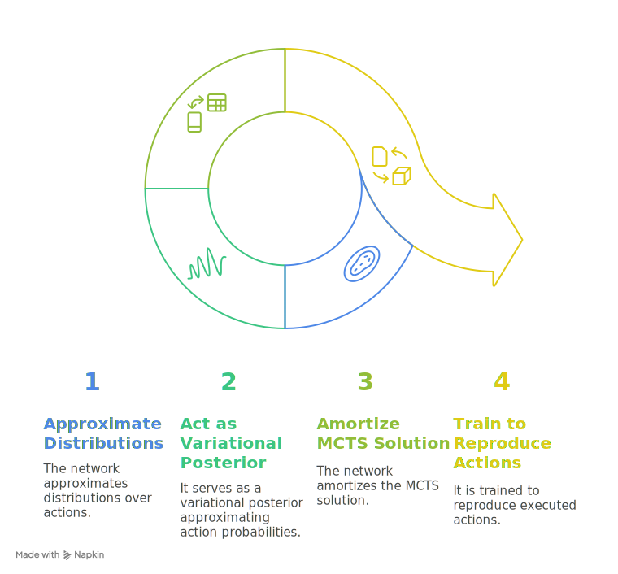
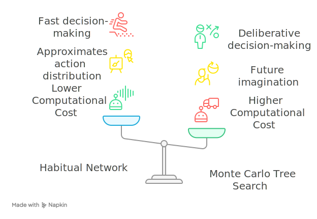

## Habitual Network

Our second approach to tackling the problem of computational cost in [@eq:mc-sampling-likelihood] is to make use of amortized inference through a **Habitual Neural Network** that directly approximates the distributions over actions, which we parameterize by $\phi_a$ and denote as $Q_{\phi_a}(a_t)$.

In essence, $Q_{\phi_a}(a_t)$ acts as a variational posterior that approximates $P(a_t|s_t)$, with a prior $P(a_t)$ calculated by MCTS.  
This means that this network *amortizes* the MCTS solution.  
During learning, this network is trained to reproduce the last executed action $q_{t-1}$ (selected by sampling $P(a_t)$) given the current state $s_{t-1}$

---

{width=50%}

---

:::: {.columns}
::: {.column width="45%"}
{width=100%}
:::
::: {.column width="49%"}
Through the combination of the approximation $Q_{\phi_a}(a_t)$ and the MCTS, the agent has at its disposal two methods of action selection:

1. $Q_{\phi_a}(a_t)$ as the *habitual network*, which corresponds to a form of fast decision-making, quickly evaluating and selecting a action; 
2. in contrast with *MCTS* --the more deliberative system that includes future imagination via MC tree traversals.
:::
::: {.column width="6%"}
<!-- this column acts as a margin for the table -->
:::
:::: 
