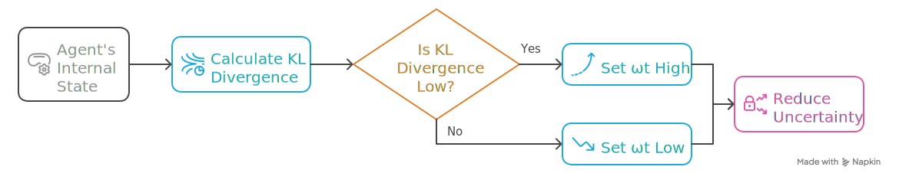

## State Transition

**State Transition Model**: $P_{\theta_s}(s_t|s_{t-1},a_{t-1})$

In this model, we take $s_t \backsim \mathcal N(\mu,\sigma^2/\omega_t)$, where the $\mu$ and $\sigma^2$ are respectively the linear and softplus units of a neural network with parameters $\theta_s$ applied to $s_{t-1}$; $\omega_t$ is the *precision factor* modulating the uncertainty on the agent's estimate of the hidden state of the environment.

To get $\mu$ we take the output (final hidden activation $h\in \mathbb R^d$) of the neural network used for parameterization of the transition function:
$$
\mu = W_\mu h + b_\mu
$$
where $W_\mu$ and $b_\mu$ are the weights and bias of the linear layer. The resulting $\mu$ is the vector of Gaussian means for each of the $d$ latent dimensions of the state space.  

---

To get $\sigma^2$ we take the output of the neural network and apply a softplus activation function:
$$
\begin{aligned}
\rho = W_\rho h + b_\rho, \quad \sigma = \text{softplus}(\rho) = \ln(1+e^\rho)
\end{aligned}
$$

All ${W_\mu}$, ${b_\mu}$, ${W_\rho}$, and ${b_\rho}$ are parameters of the neural network with parameters $\theta_s$.

We model the precision factor as a logistic (sigmoid) function of the belief update about the agent's current policy:

$$
\omega_t = \frac{\alpha}{1 + e^{-\frac{b-D_{t-1}}{c}}}+d
$$ {#eq:precision-factor}
where $D_t=D_{KL}[Q_{\phi_a}(a_t)||P(a_t)]$ is the Kullback-Leibler divergence between the habitual policy $Q_{\phi_a}(a_t)$ and the prior $P(a_t)$ ([@eq:probability-of-action]), and $\alpha$, $b$, $c$, and $d$ are hyperparameters. 

---

## Understanding $\omega_t$

- **Precision Modulation:** $\omega_t$ is a precision factor that controls the uncertainty in the agent's estimate of the hidden state. Higher $\omega_t$ means lower uncertainty (higher confidence), and lower $\omega_t$ means higher uncertainty.
- **Dynamic Adjustment:** $\omega_t$ is dynamically adjusted based on the agent's internal state. Specifically, it depends on the similarity between the agent's habitual policy $Q_{\phi_a}(a_t)$ and the planned policy $P(a_t)$ computed by MCTS. 

{height=45%}

---

$$D_{t-1} = D_{KL}[Q_{\phi_a}(a_t) \| P(a_t)]$$ 

- **Interpretation of Scenarios:**
    1. **Low divergence ($D_{t-1}$ is low):** The habitual policy closely matches the planned policy. The agent is confident in its habitual actions, so $\omega_t$ is set **high**, reducing uncertainty in the state estimate.
    2. **High divergence ($D_{t-1}$ is high):** The habitual policy differs from the planned policy. The agent is less confident, so $\omega_t$ is set **low**, increasing uncertainty in the state estimate.
- **Effect on Representation:** A higher $\omega_t$ encourages the state encoder $Q_{\phi_s}(s_t)$ to produce more independent (disentangled) latent dimensions, which can simplify learning the transition dynamics.
- **Precision Annealing:** As training progresses and the habitual network better approximates the planned policy, $\omega_t$ naturally increases. This gradual increase (precision annealing) helps stabilize learning and encourages more structured state representations.