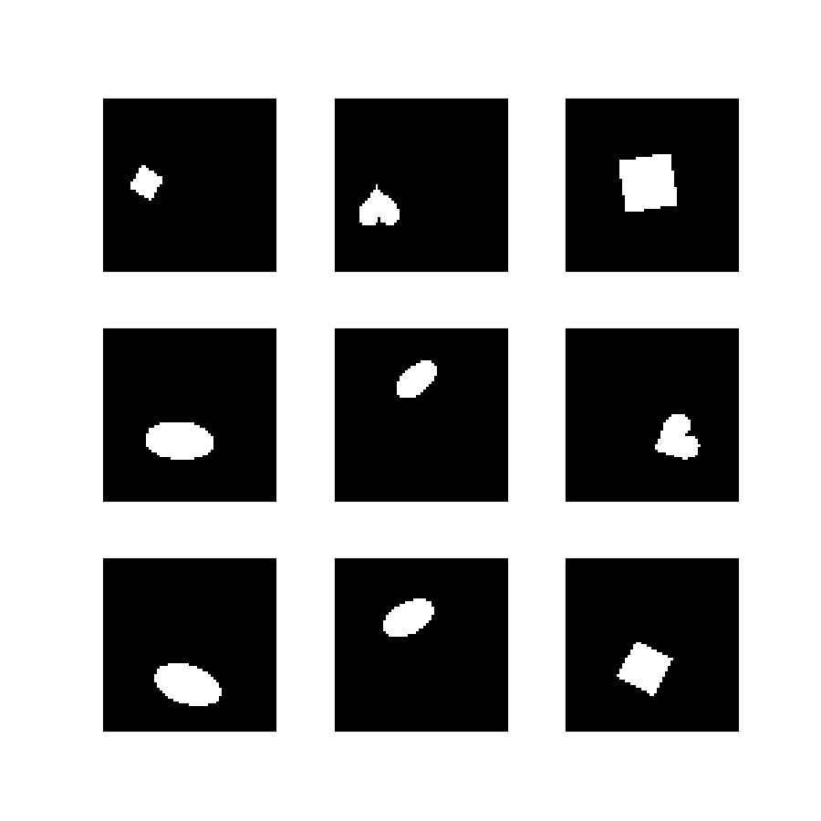
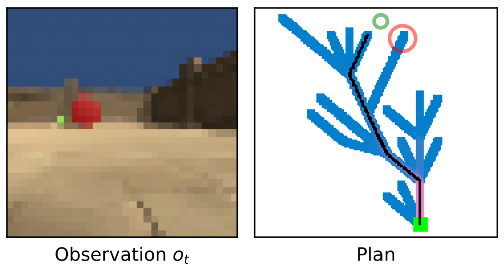

## Evaluation Environments

### Dynamic dSprites
**Object sorting** task where the agent controls the position of the object via 4 different actions (right, left, up or down) and is required to sort single objects based on their shape (a latent factor). The agent receives reward when it moves the object across the bottom border.

{width=25%}

---

## Animal-AI

Partially observable 3D environment used for showcasing the agent’s reward-directed exploration of the environment, whilst avoiding negative reward or getting stuck in corners. 

In addition, to test the agent’s ability to rely on its internal model, we used a ‘lights-off ’ variant of this task, with temporary suspension of visual input at any given time-step with probability $R$.

:::: {.columns}
::: {.column width="47%"}
![Original Animal-AI environment. Source: [@voudouris2025animalaienvironmentvirtuallaboratory]](img/Animal-AI-environment-Left-Top-view-of-the-Double-T-maze-task-The-green-ball-at-the.png)
:::
::: {.column width="47%"}

:::
::: {.column width="6%"}
<!-- this column acts as a margin for the table -->
:::
:::: 
