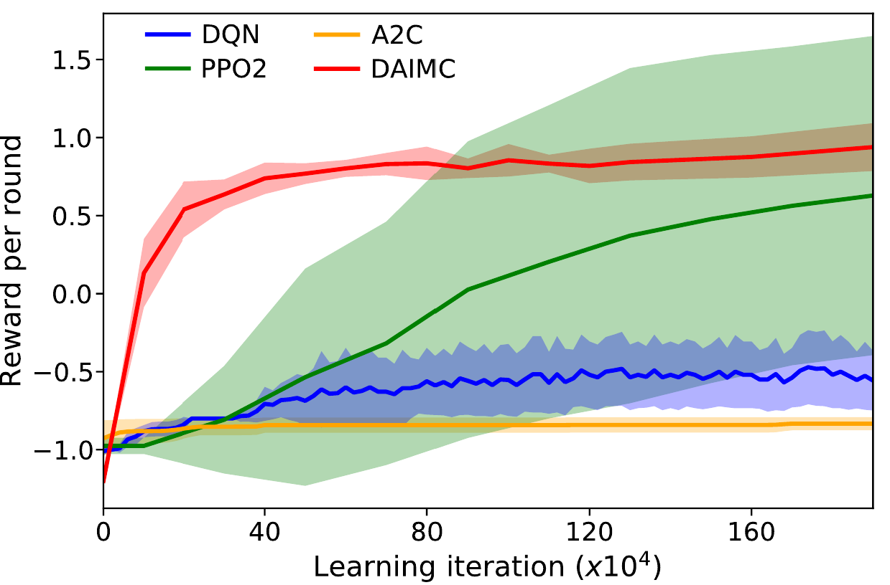

## Comparison with model-free reinforcement learning agents

{height=50%}

Note that of the two best-performing agents (DAIMC and PPO2), DAIMC has substantially less variance across training runs, indicating a more stable learning process. 
Nonetheless, these comparisons should be treated as a way of illustrating the applicability of the active inference agent operating in complex environments.
